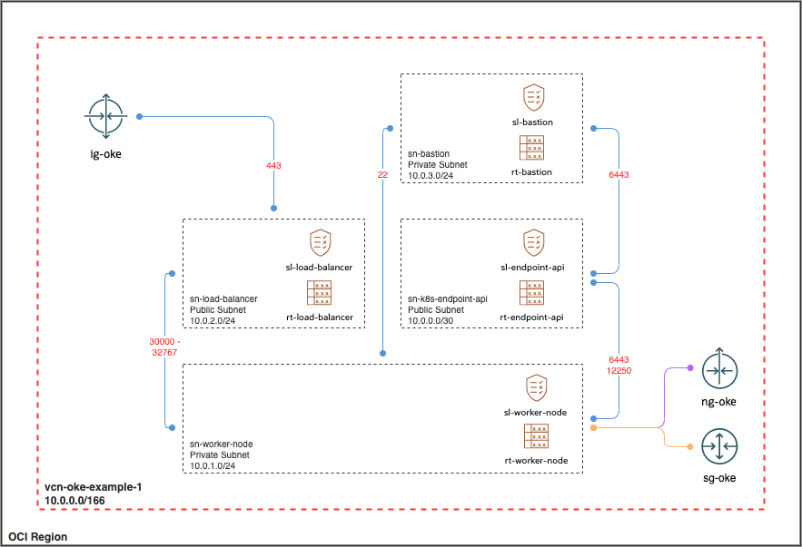

# Example 1: VCN for OKE with Flannel, Public K8s API Endpoint, Private Worker Nodes, and Public Load Balancers
The example is based on the official recommended [network configurations](https://docs.oracle.com/en-us/iaas/Content/ContEng/Concepts/contengnetworkconfigexample.htm#example-flannel-cni-publick8sapi_privateworkers_publiclb).
It uses Terraform module [cn-vcn](https://registry.terraform.io/modules/ivandelic/cn-vcn/oci/latest) to provision Virtual Cloud Network, tailored for OKE deployment, based on Flannel CNI, public K8s API endpoint, private worker nodes, and public load balancers. If you are looking for a private K8s API endpoint, it will be located in Example 2

## Prerequisites
+ OCI CLI [installed and configured](https://docs.oracle.com/en-us/iaas/Content/API/SDKDocs/cliinstall.htm)
+ Terraform [installed](https://developer.hashicorp.com/terraform/tutorials/aws-get-started/install-cli#install-cli)

## Outcome
By executing the example Terraform code, a single VCN (```vcn-oke-example-1```) will be provisioned. It's comprised of the following subnets:
+ ```sn-k8s-endpoint-api``` (10.0.0.0/30, Public)
+ ```sn-worker-node``` (10.0.1.0/24, Public)
+ ```sn-load-balancer``` (10.0.2.0/24, Private)
+ ```sn-bastion``` (10.0.3.0/24, Private)  

Each subnet has associated internet gateway (```ig-oke-example-1```), NAT gateway (```nat-oke-example-1```), service gateway (```sg-oke-example-1```) and local peering gateway (```lpg-oke-example-1```). VCN has preconfigured routes and security lists ready for hosting OKE on top of it. The final network architecture is depicted below.



## Explanation
To describe cloud-native VCN, module [cn-vcn](https://registry.terraform.io/modules/ivandelic/cn-vcn/oci/latest) uses complex variables with the following signature: 
```
name        = ""
vcn_cidr    = ""
vcn_subnets = {
  subnet-name = {
    cidr_block = ""
    is_public  = 
    rt_rules   = [...]
    sl_rules = {
      ingress_security_rules = [...]
      egress_security_rules = [...]
    }
  }
}
```
A concrete example that generates ```vcn-oke-example-1``` VCN is located in file [example-1.tfvars](example-1.tfvars).

## Run the Example

### 1. Initialize Terraform
Position terminal in ```examples/oke-flannel-public-api-example-1``` folder. Initialize Terraform with the following command:
```
terraform init
```

### 2. Execute Apply to Create VCN
Stay in the same folder and execute apply command:
```
terraform apply -var-file=example-1.tfvars
```
Action will create cloud-native VCN described in [Outcome](#outcome). Note that apply command passes parameters via the ```-var-file=example-1.tfvars``` flag. The flag references example file [example-1.tfvars](example-1.tfvars), where all the magic is defined.

### 3. Finalize
You are now ready to proceed and deploy OKE on top of created VCN.